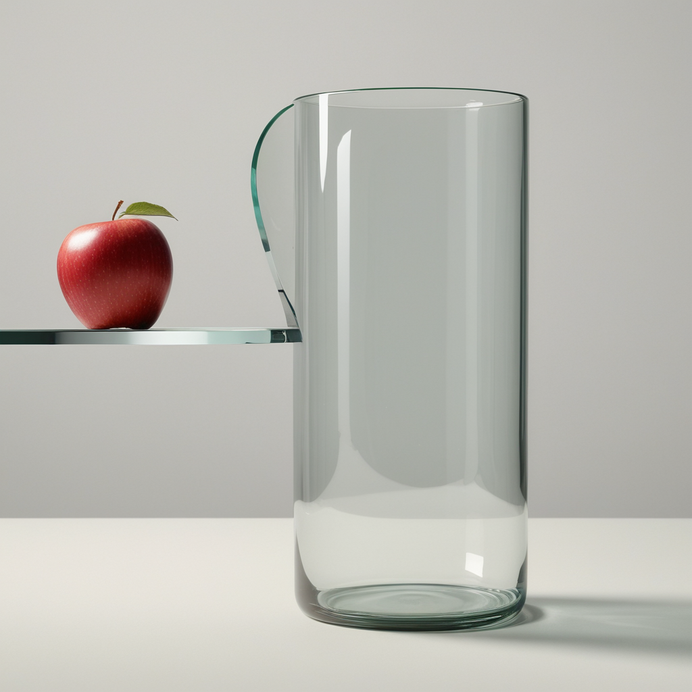
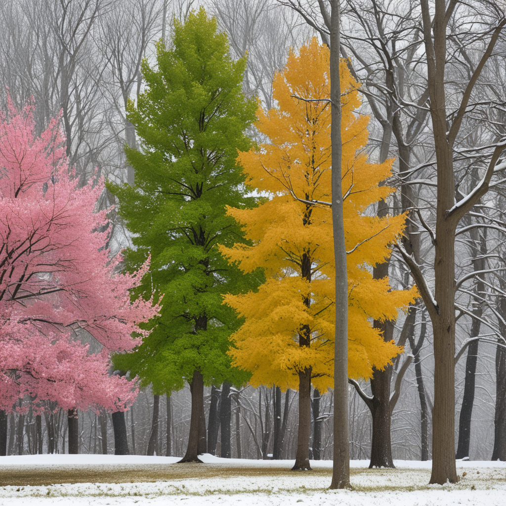

# RAG-Diffusion-SDXL
This work is based on the [RAG-Diffusion](https://github.com/NJU-PCALab/RAG-Diffusion) re-implemented in sdxl.

## Text-to-Image Generation
### 1. Set Environment
```bash
conda create -n RAG python==3.9
conda activate RAG
pip install -r requirements.txt
```
### 2. Quick Start
```python
import argparse
import json
from RegionalDiffusion_base import RegionalDiffusionPipeline
from RegionalDiffusion_xl import RegionalDiffusionXLPipeline
from RAGDiffusion_xl import RAGDiffusionXLPipeline
from diffusers.schedulers import KarrasDiffusionSchedulers,DPMSolverMultistepScheduler,EulerAncestralDiscreteScheduler
from RAG_MLLM import local_llm,GPT4
import torch
import time
# If you want to use load ckpt, initialize with ".from_single_file". 


# If you want to use diffusers, initialize with ".from_pretrained".
pipe = RAGDiffusionXLPipeline.from_pretrained("path to your diffusers",torch_dtype=torch.float16, use_safetensors=True, variant="fp16")
# pipe = RAGDiffusionXLPipeline.from_single_file("juggernautXL_v9Rdphoto2Lightning.safetensors", torch_dtype=torch.float16, use_safetensors=True, variant="fp16", local_files_only=True)

pipe.to("cuda")
pipe.scheduler = DPMSolverMultistepScheduler.from_config(pipe.scheduler.config,use_karras_sigmas=True)
# pipe.scheduler = EulerAncestralDiscreteScheduler.from_config("scheduler_config.json",use_karras_sigmas=True)

pipe.enable_xformers_memory_efficient_attention()
## User input
# para_dict = GPT4(prompt,key='Input your key here')

def parse_arguments():
    parser = argparse.ArgumentParser()
    parser.add_argument('--idx', type=int, help="Loading parameters in json")
    return parser.parse_args()

args = parse_arguments()
if args.idx is not None:
    
    json_file = './template/RAG_Gallery.json'
    with open(json_file, 'r') as f:
        data = json.load(f)

    para_dict = data[args.idx]

else:
    para_dict = {
        "prompt": 'A person drives an empty bus at night, rain streaks the windows, moonlight dimly illuminates the seats.',
        'SR_hw_split_ratio': "0.5,0.5",
        'SR_prompt': "A person driving the bus, their face illuminated by the dashboard lights, focused intently on the road ahead. BREAK The empty bus, its seats arranged neatly, echoing the silence of the night. BREAK Rain streaks on the windows, distorting the view outside and creating a sense of isolation. BREAK Moonlight filtering through, casting a gentle glow on the seats, enhancing the serene yet melancholic atmosphere of the scene.",
        # 'Regional Prompt': "A moon BREAK A vampire BREAK Two owls",
        'HB_prompt_list': ["A person driving the bus", "An empty bus", "Rain streaks on the windows", "Moonlight illuminating the seats"], 
        'HB_m_offset_list': [0.05, 0.45, 0.65, 0.85], 
        'HB_n_offset_list': [0.1, 0.1, 0.1, 0.1], 
        'HB_m_scale_list': [0.35, 0.15, 0.15, 0.15],
        'HB_n_scale_list': [0.8, 0.8, 0.8, 0.8],
        "SR_delta": 0.5,
        "HB_replace": 2,
        "height": 720,
        "width": 1280,
        "seed": -1,
    }

negative_prompt = ""
images = pipe(
    HB_replace = para_dict['HB_replace'],
    HB_prompt_list = para_dict['HB_prompt_list'],
    HB_m_offset_list = para_dict['HB_m_offset_list'],
    HB_n_offset_list = para_dict['HB_n_offset_list'],
    HB_m_scale_list = para_dict['HB_m_scale_list'],
    HB_n_scale_list = para_dict['HB_n_scale_list'],
    prompt = para_dict['SR_prompt'],
    split_ratio = para_dict['SR_hw_split_ratio'], # The ratio of the regional prompt, the number of prompts is the same as the number of regions, and the number of prompts is the same as the number of regions
    batch_size = 1, #batch size
    base_ratio = para_dict['SR_delta'], # The ratio of the base prompt    
    base_prompt= para_dict['prompt'],       
    num_inference_steps=15, # sampling step, 
    height = para_dict['height'], 
    negative_prompt=negative_prompt, # negative prompt
    width = para_dict['width'], 
    seed = para_dict['seed'],# random seed
    guidance_scale = 2.0
).images[0]
images.save("test.png")
```
### 3. NOTICE
- I test it with SDXL Lightning model, so the guidance_scale is set to 2.0 and sampling step is set to 15. You can modify these parameters according to the model you use.

## Gallery

### 1. Image Inference

<details open>
<summary>Examples</summary> 
<table class="center">
  <tr>
    <td width=25% style="border: none"></td>
    <td width=25% style="border: none"></td>
  </tr>
  <tr>
    <td width="25%" style="border: none; text-align: center; word-wrap: break-word">A vampire is standing under a bright moon while two owls are on a big oak.</td>
    <td width="25%" style="border: none; text-align: center; word-wrap: break-word">穿花蛱蝶深深见，点水蜻蜓款款飞.</td>
  </tr>
  <tr>
    <td width="25%" style="border: none; text-align: center; word-wrap: break-word">
      <pre style="background-color: #f4f4f4; padding: 10px; border-radius: 5px; font-family: Consolas, monospace; font-size: 16px; display: inline-block;">python RAG.py --idx=0</pre>
    </td>
    <td width="25%" style="border: none; text-align: center; word-wrap: break-word">
      <pre style="background-color: #f4f4f4; padding: 10px; border-radius: 5px; font-family: Consolas, monospace; font-size: 16px; display: inline-block;">python RAG.py --idx=1</pre>
    </td>
  </tr>
</table>
<table class="center">
  <tr>
    <td width=100% style="border: none"></td>
  </tr>
  <tr>
    <td width="100%" style="border: none; text-align: center; word-wrap: break-word">On the left, Einstein is painting the Mona Lisa; in the center, Elon Reeve Musk is participating in the U.S. presidential election; on the right, Trump is hosting a Tesla product launch.</td>
  </tr>
  <tr>
    <td width="50%" style="border: none; text-align: center; word-wrap: break-word">
      <pre style="background-color: #f4f4f4; padding: 10px; border-radius: 5px; font-family: Consolas, monospace; font-size: 16px; display: inline-block;">python RAG.py --idx=2</pre>
    </td>
    </td>
  </td>
  <tr>
    <td width=100% style="border: none"></td>
  </tr>
  <tr>
    <td width="100%" style="border: none; text-align: center; word-wrap: break-word">On the left, a penguin wearing sunglasses is sunbathing in the desert; in the center, a tiger wearing a scarf is standing on a glacier; on the right, a panda in a windbreaker is walking through the forest.</td>
  </tr>
  <tr>
    <td width="50%" style="border: none; text-align: center; word-wrap: break-word">
      <pre style="background-color: #f4f4f4; padding: 10px; border-radius: 5px; font-family: Consolas, monospace; font-size: 16px; display: inline-block;">python RAG.py --idx=3</pre>
    </td>
    </td>
  </tr>
</table>
<table class="center">
  <tr>
    <td width=25% style="border: none"></td>
    <td width=25% style="border: none"></td>
    <td width=25% style="border: none"></td>
  </tr>
  <tr>
    <td width="25%" style="border: none; text-align: center; word-wrap: break-word">A balloon on the bottom of a dog.</td>
    <td width="25%" style="border: none; text-align: center; word-wrap: break-word">A cylindrical glass, obscuring the right half of the apple behind it.</td>
    <td width="25%" style="border: none; text-align: center; word-wrap: break-word"> From left to right, Pink blossoming trees, Green sycamore trees, Golden maples and Snow-blanketed pines.</td>
  </tr>
  <tr>
    <td width="25%" style="border: none; text-align: center; word-wrap: break-word">
      <pre style="background-color: #f4f4f4; padding: 10px; border-radius: 5px; font-family: Consolas, monospace; font-size: 16px; display: inline-block;">python RAG.py --idx=5</pre>
    </td>
    <td width="25%" style="border: none; text-align: center; word-wrap: break-word">
      <pre style="background-color: #f4f4f4; padding: 10px; border-radius: 5px; font-family: Consolas, monospace; font-size: 16px; display: inline-block;">python RAG.py --idx=6</pre>
    </td>
    <td width="25%" style="border: none; text-align: center; word-wrap: break-word">
      <pre style="background-color: #f4f4f4; padding: 10px; border-radius: 5px; font-family: Consolas, monospace; font-size: 16px; display: inline-block;">python RAG.py --idx=7</pre>
    </td>
  </tr>
</table>
</details>

# Acknowledgements
This work is builted upon several solid works. Thanks to [regional-prompter](https://github.com/hako-mikan/sd-webui-regional-prompter), [diffusers](https://github.com/huggingface/diffusers), [RAG](https://github.com/NJU-PCALab/RAG-Diffusion), [RPG](https://github.com/YangLing0818/RPG-DiffusionMaster?tab=readme-ov-file).